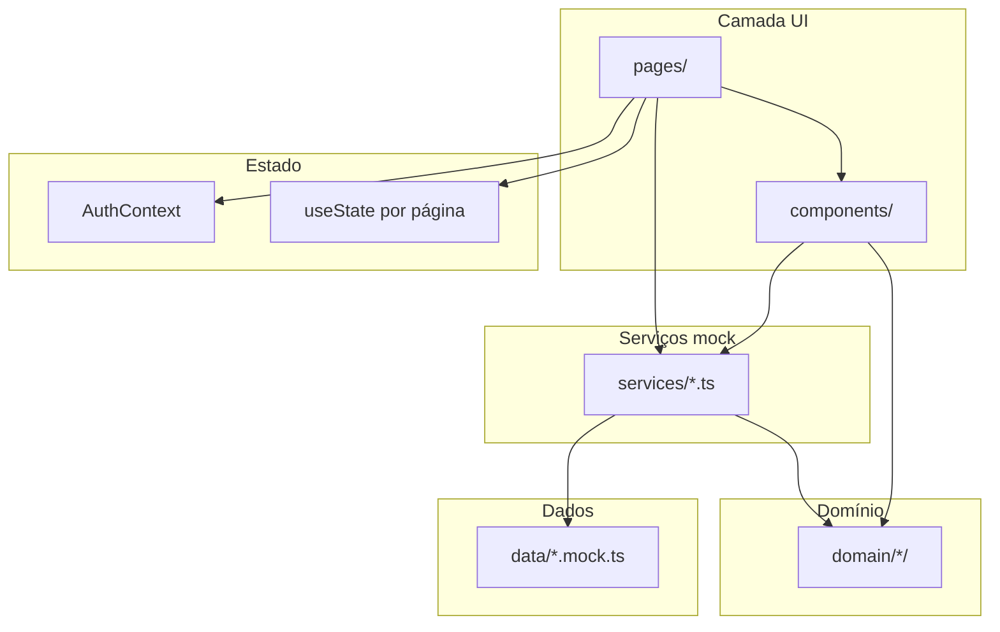

# Architecture

**Pattern:** SPA monolítica frontend-only com camadas por responsabilidade (UI → serviços → domínio → mocks)

## High-Level Structure



## Identified Patterns

### Persona-prefixed components

**Location:** `src/components/{seller,admin,analyst}/`, `src/pages/{seller,admin,analyst}/`
**Purpose:** Isolar UI por persona (cedente, admin, analista de risco)
**Implementation:** Prefixos `Seller*`, `Admin*`, `Analyst*`; rotas protegidas por perfil
**Example:** `SellerDuplicatasPage.tsx`, `AnalystDuplicataApprovalWizardDialog.tsx`

### Centralized route constants

**Location:** `src/lib/routes.ts`
**Purpose:** Evitar strings mágicas de rota em links e navegação
**Implementation:** Objeto `ROUTES` tipado com funções para IDs dinâmicos (`detail(id)`)
**Example:** `ROUTES.analyst.duplicatas.detail(id)` — consumido em ~25 arquivos

### Protected routing inline

**Location:** `src/App.tsx`
**Purpose:** Guardar rotas autenticadas por perfil
**Implementation:** `ProtectedRoute` verifica `isAuthenticated` e `selectedProfile`; redireciona para `/login` ou `/select-profile`
**Example:**

```30:35:src/App.tsx
function ProtectedRoute({ children, profile }: { children: React.ReactNode; profile?: string }) {
  const { isAuthenticated, selectedProfile } = useAuth();
  if (!isAuthenticated) return <Navigate to="/login" replace />;
  if (profile && selectedProfile !== profile) return <Navigate to="/select-profile" replace />;
  return <>{children}</>;
}
```

### Mock service layer

**Location:** `src/services/*.ts`
**Purpose:** Simular API com latência e mutação de estado em memória
**Implementation:** `sleep(ms)` + arrays mutáveis importados de mocks; funções `fetch*`, `create*`, `update*`, `set*`
**Example:** `duplicata.service.ts` mantém `let duplicatas: DuplicataTitulo[]`

### Domain-driven types and rules

**Location:** `src/domain/`
**Purpose:** Tipos, schemas Zod, helpers e constantes de negócio separados da UI
**Implementation:** Um subdiretório por bounded context (`duplicata`, `seller`, `receivables`, `risk-analyst`, etc.)
**Example:** `canSellerRegisterDuplicatas()` em `domain/seller/seller-duplicata-access.ts`

### App shell layout

**Location:** `src/components/layout/AppShell.tsx`, `PublicShell.tsx`
**Purpose:** Layout consistente autenticado (sidebar + header) vs público (topbar)
**Implementation:** Rotas protegidas envolvem `<AppShell>`; páginas públicas usam `<PublicShell>` (inclui `PublicHeader`)
**Example:** `LoginPage` → `PublicShell`; `SellerDashboardPage` → `ProtectedRoute` + `AppShell`

## Data Flow

### Autenticação e seleção de perfil

```
LoginPage → MockLoginForm → auth.service.mockLogin()
  → AuthContext.login(email, name, profile?)
  → SelectProfilePage → setProfile(profile)
  → auth.helpers.getProfileRedirect(profile) → navigate(ROUTES.*)
  → ProtectedRoute valida selectedProfile
```

**Nota:** Sessão não persiste (sem `localStorage` de auth). `user.profile` é sempre `"seller"` no login, independente do perfil selecionado depois.

### Cadastro de cedente (onboarding)

```
SellerRegistrationPage → SellerRegistrationWizard (multi-step)
  → domain/seller/seller-registration.schema.ts (Zod por etapa)
  → seller-registration.service.ts → toast + redirect
  → SellerRegistrationCompletePage
```

### Duplicata: cedente → analista → operação

```
NewDuplicataForm → validate() inline → duplicata.service.createDuplicata()
  → AnalystDuplicatasPage → AnalystDuplicataDetailPage
  → AnalystDuplicataApprovalWizardDialog → setDuplicataAnaliseAnalista()
  → SellerDuplicataOperacaoWizardDialog → setDuplicataDecisaoAntecipacaoCedente()
```

### Revisão cadastral (analista/admin)

```
AnalystSellersPage → SellerReviewDetailPage (compartilhada admin/analyst)
  → seller-review.service.ts (score/pontos mockados como IA)
  → AnalystCadastralReviewWizardDialog → decisão cadastral
```

## Code Organization

**Approach:** Híbrido layer-based + feature-by-persona

**Structure:**

| Camada | Diretório | Responsabilidade |
|--------|-----------|------------------|
| Entry | `main.tsx`, `App.tsx` | Bootstrap, router, guards |
| Pages | `src/pages/` | Composição de tela por rota |
| Components | `src/components/` | UI reutilizável (ui/, layout/, persona/) |
| Context | `src/contexts/` | Estado global mínimo (auth) |
| Services | `src/services/` | Acesso a dados mockados |
| Domain | `src/domain/` | Tipos, schemas, regras, helpers |
| Data | `src/data/` | Seeds e fixtures mock |
| Lib | `src/lib/` | Rotas, formatters, utils |
| Hooks | `src/hooks/` | Hooks compartilhados (apenas `use-mobile.ts`) |

**Module boundaries:**

- UI **não** deve conter regra de negócio complexa (ideal); exceção atual: `NewDuplicataForm.validate()` inline
- Serviços **não** devem conter lógica de UI (seguido consistentemente)
- Domínio **não** importa React nem serviços
- Mocks importam tipos de domínio, nunca o contrário

## Dual model: duplicatas vs receivables

O fluxo principal (hackathon) usa **duplicatas** (PT) em seller/analyst. Admin ainda expõe **receivables** (EN) via `receivables.service.ts` e `AdminReceivablesPage`. São dois modelos paralelos com mocks separados — ver CONCERNS.md.
