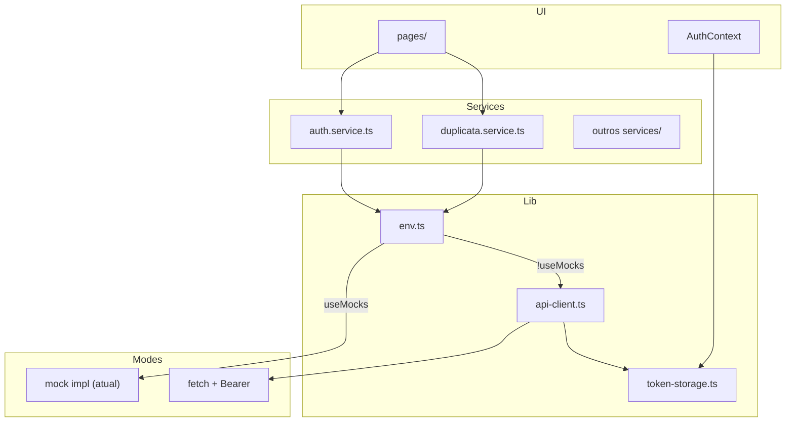
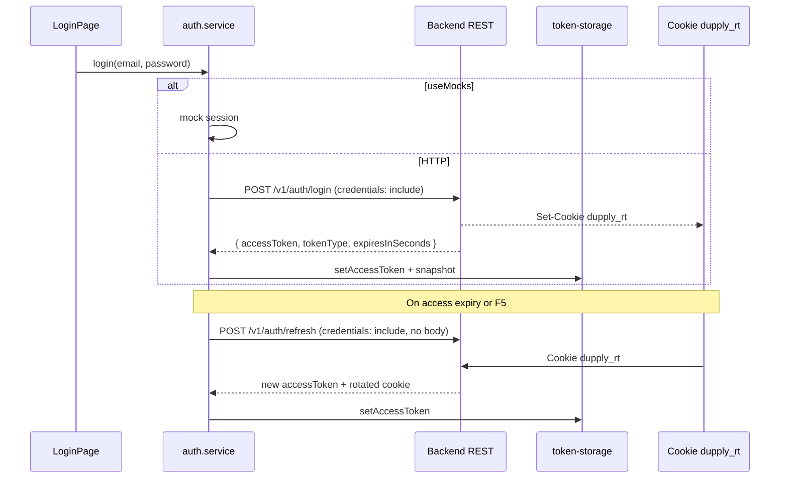

# API Integration — Design

**Spec:** [spec.md](./spec.md)  
**Status:** Auth contract confirmed — other REST paths still placeholders

---

## Architecture Overview



---

## Components

### `src/lib/env.ts`

Centraliza leitura de env Vite.

| Var | Default | Propósito |
|-----|---------|-----------|
| `VITE_USE_MOCKS` | `true` | Mock mode (string `"false"` desliga) |
| `VITE_API_BASE_URL` | `""` | Base REST |
| `VITE_API_TIMEOUT_MS` | `30000` | Timeout fetch |

```ts
export const env = {
  useMocks: import.meta.env.VITE_USE_MOCKS !== "false",
  apiBaseUrl: import.meta.env.VITE_API_BASE_URL ?? "",
  apiTimeoutMs: Number(import.meta.env.VITE_API_TIMEOUT_MS ?? 30_000),
};
```

### `src/lib/token-storage.ts`

| Função | Comportamento |
|--------|---------------|
| `getAccessToken()` | Lê de `sessionStorage` key `dupply_access_token` |
| `setAccessToken(token)` | Persiste / remove |
| `clearAccessToken()` | Logout |

Premissa: Bearer access token curto em `sessionStorage`; refresh token opaco em cookie `dupply_rt` (HttpOnly, gerenciado pelo browser).

### `src/lib/api-client.ts`

```ts
export type ApiRequestOptions = {
  method?: "GET" | "POST" | "PATCH" | "PUT" | "DELETE";
  body?: unknown;
  auth?: boolean; // default true
  credentials?: RequestCredentials; // use "include" for /v1/auth/*
};

async function apiRequest<T>(path: string, options?: ApiRequestOptions): Promise<T>
```

**Comportamento:**

1. Se `env.useMocks` → **não usar** (services chamam mock direto)
2. Prefixa `env.apiBaseUrl + path`
3. Headers: `Content-Type: application/json`, `Authorization: Bearer ...` se `auth`
4. `credentials`: default omit/`same-origin`; auth routes passam `"include"`
5. Erros: `ApiError` com `status`, `message`, body parseado
6. 401 em request autenticada → tentar refresh (service) ou `clearAuthStorage()` + callback logout

### Service adapter pattern

Cada service mantém **assinatura pública**; implementação interna bifurca:

```ts
export async function fetchAllDuplicatas(): Promise<DuplicataTitulo[]> {
  if (env.useMocks) return fetchAllDuplicatasMock();
  return apiRequest<DuplicataTitulo[]>("/duplicatas");
}
```

Mock logic extraída para funções `*Mock()` no mesmo arquivo ou `*.mock.impl.ts` — evita duplicar durante transição.

**Services a migrar (ordem):**

1. `auth.service.ts`
2. `duplicata.service.ts`
3. `seller-registration.service.ts`
4. `seller-review.service.ts`
5. `seller.service.ts`, `admin.service.ts` (pós-demo)

---

## Auth flow (Bearer access + HttpOnly refresh cookie)



**DTO login response (confirmado):**

```ts
type LoginResponse = {
  accessToken: string;
  tokenType: "Bearer";
  expiresInSeconds: number;
  // refreshToken NÃO vem no JSON — cookie dupply_rt
};
```

---

## Reuse

| Existente | Reuso |
|-----------|-------|
| `sleep()` em services | Manter em mocks |
| `domain/*` types | DTOs mapeiam para domain types |
| `AuthContext` | Estender com `restoreSession()` no mount |
| `.cursor/rules/40-services-mocks` | Padrão fetch/create preservado |

---

## Env files

```
.env.example     # commitado — defaults mock
.env.local       # gitignored — override dev
```

**.env.example:**

```env
VITE_USE_MOCKS=true
VITE_API_BASE_URL=
# VITE_API_BASE_URL=http://localhost:3000/api
```

---

## Switch mock → HTTP

| Passo | Ação |
|-------|------|
| 1 | Copiar `.env.example` → `.env.local` (se ainda não existir) |
| 2 | `VITE_USE_MOCKS=false` |
| 3 | `VITE_API_BASE_URL=https://...` (sem barra final; paths no `api-client` começam com `/`) |
| 4 | Reiniciar `npm run dev` (Vite lê env só no boot) |

**Helpers (`src/lib/env.ts`):**

| Export | Uso |
|--------|-----|
| `env.useMocks` | Leitura direta da flag |
| `isApiConfigured()` | `!useMocks && baseUrl` — gate antes de HTTP |
| `resolveApiMode()` | `"mock"` \| `"http"` — preferir nos adapters; fallback mock + `console.warn` se URL ausente |

**Padrão nos services (T3+):**

```ts
if (resolveApiMode() === "mock") return fetchAllDuplicatasMock();
return apiRequest<DuplicataTitulo[]>("/duplicatas");
```

**Comportamento atual (pós-T1/T2):** nenhum service importa `api-client` ainda — app idêntico com mocks. Só após T3–T5 o switch altera runtime.

**Gate manual:** login mock + fluxo duplicata como hoje com `VITE_USE_MOCKS=true` (default).

---

## Migration strategy

| Fase | Ação | Risco |
|------|------|-------|
| **A** (agora) | Scaffold lib/ + .env.example; zero mudança runtime | Nenhum |
| **B** | Adapter nos services; default mock | Baixo |
| **C** | Auth HTTP + token storage | Médio |
| **D** | Duplicatas HTTP | Médio |
| **E** | P1 services | Médio |

Não migrar tudo de uma vez — um service por task com gate typecheck.

---

## Concerns mitigados

| CONCERNS item | Mitigação |
|---------------|-----------|
| Auth sem persistência | token-storage + restoreSession |
| Estado mutável global | mocks isolados; HTTP stateless |
| user.profile hardcoded | user vem do DTO login |

---

## Open items (backend)

- [x] Bearer access token confirmed
- [x] Auth paths: `/v1/auth/login`, `/v1/auth/refresh`, `/v1/auth/logout`
- [x] Refresh token via HttpOnly cookie `dupply_rt` — frontend must use `credentials: "include"`
- [ ] Confirm response DTO shapes for non-auth domains
- [x] CORS — `credentials: true` + origin allowlist on backend
