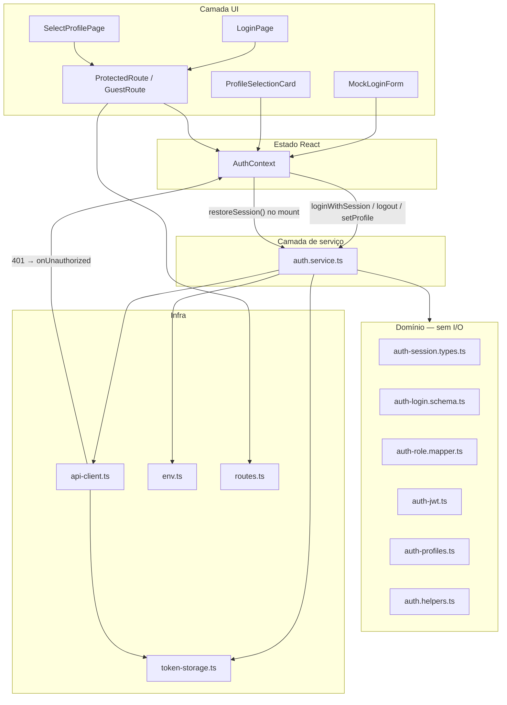
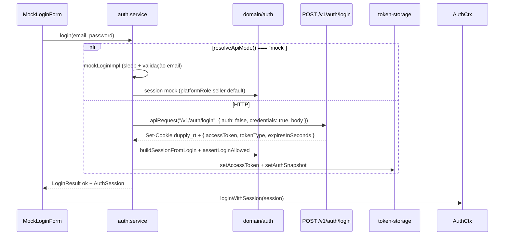
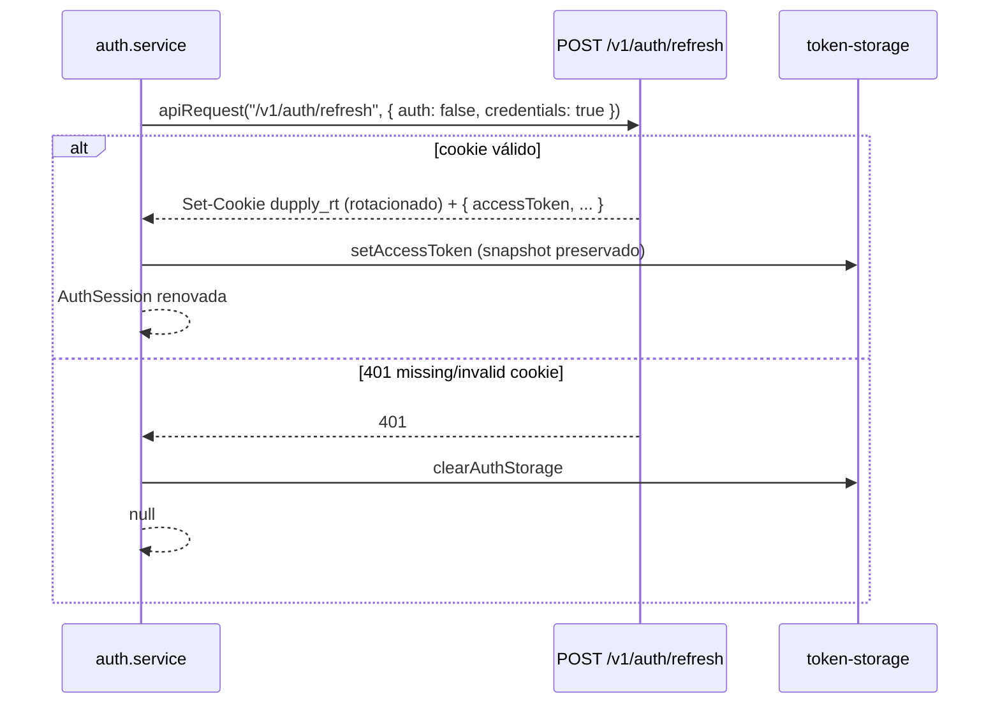
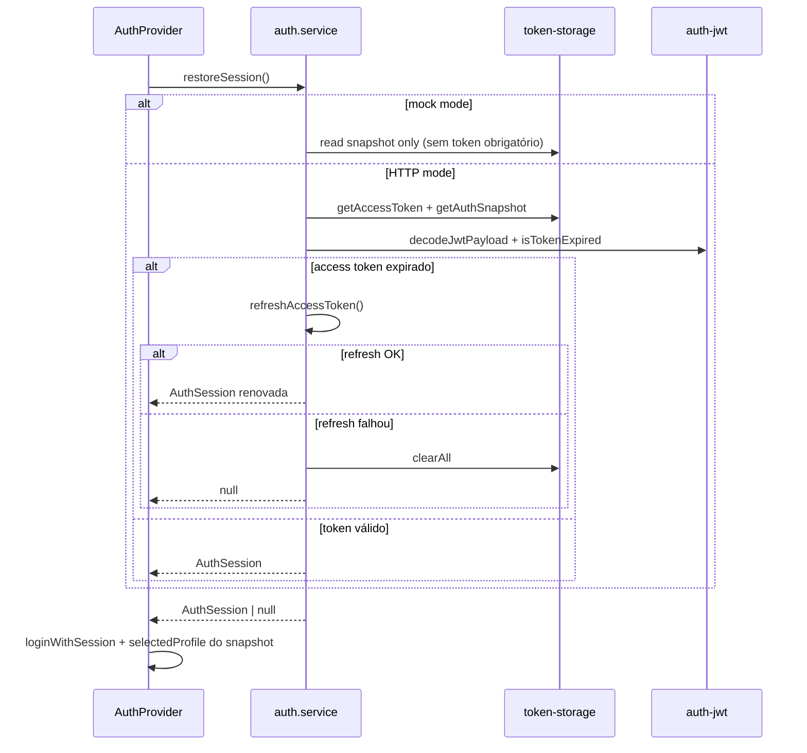
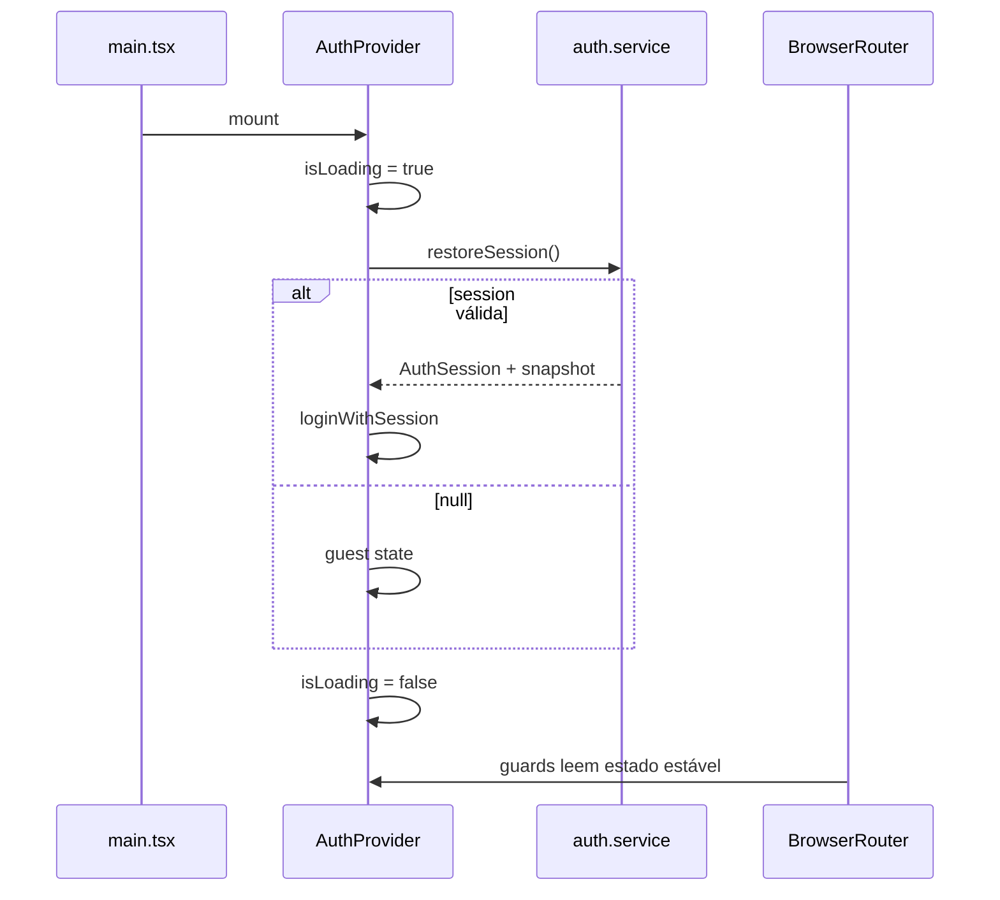

# Auth Login & Persistência — Design

**Spec:** [spec.md](./spec.md)  
**Status:** Draft — pronto para implementação  
**Depende de:** [api-integration/design.md](../api-integration/design.md) (`api-client`, `token-storage`, `env`)

---

## Architecture Overview



### Regras de fronteira (reforço)

| Camada | Responsabilidade | Proibido |
|--------|------------------|----------|
| **Pages / components** | UI, chamar `useAuth()` / `auth.service.login()`, navegar com `ROUTES` | `fetch`, `apiRequest`, `sessionStorage` direto |
| **AuthContext** | `AuthState`, bootstrap, expor API estável | HTTP, decode JWT, mapeamento de role |
| **auth.service.ts** | Orquestração mock/HTTP, persistência, erros de domínio | JSX, hooks, `navigate` |
| **domain/auth/** | Tipos, Zod, mappers, helpers puros | React, `api-client`, storage |
| **lib/** | Transporte e persistência genérica | Lógica de negócio auth |

---

## Estado alvo

### `AuthState` (estendido)

```ts
interface AuthState {
  isAuthenticated: boolean;
  isLoading: boolean;           // true durante restoreSession no boot
  user: SessionUser | null;     // substitui MockUser
  selectedProfile: UserProfile | null;
}

interface SessionUser {
  id: string;
  email: string;
  name: string;
  platformRole: string;         // role bruta do backend / mock
}
```

**Decisões:**

- `isAuthenticated` continua explícito (guards já o usam); derivado de `user !== null` após restore/login.
- `MockUser.profile` **deprecado** — perfil ativo vive só em `selectedProfile`; `platformRole` informa quais perfis UI são permitidos.
- `isLoading` evita flash de redirect em guards durante reidratação (ALP-09 edge case).

### `AuthContextValue` (API pública)

| Método | Assinatura | Responsabilidade |
|--------|------------|------------------|
| `loginWithSession` | `(session: AuthSession, selectedProfile?: UserProfile \| null) => void` | Aplica sessão normalizada vinda do service |
| `logout` | `(options?: { reason?: "manual" \| "expired" }) => void` | Reseta estado guest; service limpa storage |
| `setProfile` | `(profile: UserProfile) => void` | Atualiza perfil + persiste snapshot via service |
| `restoreSession` | interno ao provider | Chama `auth.service.restoreSession()` no mount |

**Remover / substituir:**

- `login(email, name?, selectedProfileOnLogin?)` → fluxo passa por `auth.service.login()` + `loginWithSession()`.
- Manter compatibilidade temporária só se algum caller externo existir; `MockLoginForm` migra no mesmo PR.

---

## Domain layer (`src/domain/auth/`)

### Novos arquivos

#### `auth-session.types.ts`

```ts
type AuthSession = {
  user: SessionUser;
  accessToken?: string;      // ausente em mock puro
  expiresAtMs?: number;      // derivado de JWT exp ou mock TTL
};

type PersistedAuthSnapshot = {
  userId: string;
  email: string;
  platformRole: string;
  selectedProfile: UserProfile | null;
};
```

#### `auth-login.schema.ts`

Zod para formulário de login — mensagens em PT:

| Campo | Regra | Mensagem |
|-------|-------|----------|
| `email` | obrigatório, formato e-mail | "Informe um e-mail válido" |
| `password` | obrigatório, min 1 | "Informe sua senha" |

Usado em `MockLoginForm` (validação client-side antes do service).

#### `auth-role.mapper.ts`

| Backend `role` | `UserProfile` | Ação |
|----------------|---------------|------|
| `seller` | `seller` | OK |
| `admin` | `admin` | OK |
| `risk_analyst`, `risk_analyst_agent` | `riskAnalyst` | OK |
| `payer` | — | Erro `PayerPersonaUnavailableError` (PT) |
| desconhecido | — | Erro genérico "Perfil não disponível" |

Exports:

```ts
function mapPlatformRoleToProfiles(role: string): UserProfile[]
function assertLoginAllowed(role: string): void  // lança se payer/inválido
```

#### `auth-jwt.ts`

Decode **sem verificar assinatura** (ALP-19):

```ts
type JwtPayload = { sub: string; role: string; profileId?: string; exp?: number };

function decodeJwtPayload(token: string): JwtPayload | null
function isTokenExpired(payload: JwtPayload): boolean  // exp no passado ou ausente → tratar como expirado em HTTP
function buildSessionFromLogin(email: string, accessToken: string, expiresInSeconds: number): AuthSession
```

#### `auth-profiles.ts`

```ts
function getAvailableProfiles(platformRole: string): UserProfile[]
function shouldAutoSelectProfile(profiles: UserProfile[]): UserProfile | null  // length === 1
```

Reutiliza `getProfileRedirect`, `getProfileLabel`, `getProfileDescription` de `auth.helpers.ts`.

### `auth.types.ts` (modificar)

- Renomear/exportar `SessionUser` (substituir `MockUser` ou alias temporário `@deprecated`).
- Estender `AuthState` com `isLoading`.

---

## Service layer (`src/services/auth.service.ts`)

### API pública

```ts
type LoginResult =
  | { ok: true; session: AuthSession; redirectHint: "selectProfile" | "dashboard" }
  | { ok: false; code: LoginErrorCode; message: string };

type LoginErrorCode =
  | "invalid_credentials"
  | "account_inactive"
  | "validation_error"
  | "payer_unavailable"
  | "network"
  | "unknown";

async function login(email: string, password: string): Promise<LoginResult>
async function refreshAccessToken(): Promise<AuthSession | null>
async function logout(): Promise<void>
async function restoreSession(): Promise<AuthSession | null>
async function persistSelectedProfile(profile: UserProfile): Promise<void>
```

### Fluxo `login()`



**Mock impl:** preservar comportamento atual (`sleep(800)`, aceita qualquer senha se email preenchido). `platformRole: "seller"` para demo; três cards em `SelectProfilePage`.

**HTTP impl:**

- Path: `POST /v1/auth/login` (prefixo `/v1` confirmado no backend).
- Request: `{ email, password }`.
- **Credentials:** `credentials: "include"` — obrigatório para receber e manter cookie `dupply_rt`.
- Response DTO interno (não exportar para UI):

```ts
type LoginResponseDto = {
  accessToken: string;
  tokenType: "Bearer";
  expiresInSeconds: number;
};
```

- Mapeamento de erros HTTP → `LoginErrorCode` + mensagem PT:

| Status / body | `LoginErrorCode` | Mensagem UI |
|---------------|------------------|-------------|
| 401 `invalid_credentials` | `invalid_credentials` | "E-mail ou senha incorretos" |
| 403 `account_inactive` | `account_inactive` | "Sua conta está inativa. Entre em contato com o suporte." |
| 400 `validation_error` | `validation_error` | mensagem do body ou genérica |
| 503 | `unknown` | "Serviço temporariamente indisponível" |
| rede / timeout / abort | `network` | "Não foi possível conectar. Tente novamente." |
| role `payer` pós-decode | `payer_unavailable` | "Este tipo de acesso ainda não está disponível na plataforma." |

**Importante:** em falha de login, service **não** grava token nem altera storage (ALP-04). O refresh token **nunca** entra no JSON — fica no cookie `dupply_rt`.

### Fluxo `refreshAccessToken()`

Chamado internamente por `restoreSession()` quando o access token expirou mas o cookie de refresh pode existir.



- Sem body na request.
- Não expor `refreshToken` ao domínio/UI.
- Em sucesso, reutilizar snapshot existente para montar `AuthSession`.

### Fluxo `restoreSession()`



- Idempotente para StrictMode double-mount: flag `restoreStarted` ref no provider ou promise memoizada no service.
- Falha silenciosa → guest, sem toast (ALP-06).

### Fluxo `logout()`

1. Se modo HTTP: `POST /v1/auth/logout` com `credentials: "include"` (best-effort — ignorar erro de rede após limpar local).
2. `clearAccessToken()` + `clearAuthSnapshot()` em `token-storage`.
3. Context reseta para guest.

Logout **não** exige Bearer — o backend identifica a sessão pelo cookie `dupply_rt`.

### `persistSelectedProfile()`

Chamado por `AuthContext.setProfile()`:

1. Atualiza snapshot em `sessionStorage`.
2. (P2+) Quando `PATCH /users/me/profile` existir, adapter interno HTTP — assinatura pública inalterada.

---

## Infra extensions

### `src/lib/token-storage.ts`

| Chave | Conteúdo |
|-------|----------|
| `dupply_access_token` | JWT (existente) |
| `dupply_auth_snapshot` | JSON `PersistedAuthSnapshot` |

| Função | Comportamento |
|--------|---------------|
| `getAuthSnapshot()` | parse JSON ou `null` se corrompido |
| `setAuthSnapshot(snapshot)` | stringify |
| `clearAuthSnapshot()` | remove key |
| `clearAuthStorage()` | token + snapshot (usado em logout/401/expired) |

### `src/lib/api-client.ts` — credentials + callback 401 → AuthContext

Estender `ApiRequestOptions`:

```ts
export type ApiRequestOptions = {
  method?: HttpMethod;
  body?: unknown;
  auth?: boolean;           // default true
  credentials?: RequestCredentials; // default "same-origin"; usar "include" em /v1/auth/*
};
```

Passar `credentials` ao `fetch`. Auth endpoints (`/v1/auth/login`, `/v1/auth/refresh`, `/v1/auth/logout`, `/v1/auth/register`) **sempre** usam `credentials: "include"`.

Registrar handler no boot do `AuthProvider`:

```ts
// api-client.ts
type UnauthorizedHandler = () => void;
let onUnauthorized: UnauthorizedHandler | null = null;

export function setUnauthorizedHandler(handler: UnauthorizedHandler | null): void
```

Comportamento em `401` (requests autenticadas):

1. Tentar `refreshAccessToken()` **uma vez** se `auth: true` (opcional nesta fase — pode ficar no service antes do throw).
2. Se refresh falhar: `clearAuthStorage()` (token + snapshot).
3. Invocar `onUnauthorized()` se registrado.
4. Lançar `ApiError` (callers podem ignorar se sessão já limpa).

No `AuthProvider`:

```ts
useEffect(() => {
  setUnauthorizedHandler(() => {
    logout({ reason: "expired" }); // toast opcional ALP-18
    navigate(ROUTES.login, { replace: true });
  });
  return () => setUnauthorizedHandler(null);
}, []);
```

**Nota:** `navigate` via `useNavigate` no provider exige wrapper interno ou evento mínimo — preferir subcomponente `AuthSessionSync` filho de `BrowserRouter` em `main.tsx`:

```
main.tsx: AuthProvider → BrowserRouter → AuthSessionSync + App
```

Alternativa aceitável: handler só chama `logout`; redirect fica a cargo de guard na próxima render (mais simples, sem navigate no provider).

---

## UI layer

### `MockLoginForm.tsx`

| Antes | Depois |
|-------|--------|
| `mockLogin` + `login(email)` manual | `auth.service.login()` → `loginWithSession` |
| sem toast em erro | `toast.error(result.message)` |
| sempre `navigate(selectProfile)` | redirect conforme `redirectHint` + auto-skip perfil |

Fluxo pós-sucesso:

1. `loginWithSession(session)`.
2. Se `shouldAutoSelectProfile` → `setProfile` + `navigate(getProfileRedirect)`.
3. Senão → `navigate(ROUTES.selectProfile)`.
4. Se `location.state.from` existir (deep link) → priorizar retorno após perfil selecionado.

### `LoginPage.tsx`

Extrair guard guest para `GuestRoute`:

- Se `isLoading` → spinner/null breve.
- Se `isAuthenticated` → redirect:
  - com `selectedProfile` → `getProfileRedirect(selectedProfile)`
  - sem perfil → `ROUTES.selectProfile`

Usar `isAuthenticated` (não `user` truthy) — alinha com `ProtectedRoute`.

### `SelectProfilePage.tsx`

- Guard semi-protegido: guest → `ROUTES.login`; `isLoading` → spinner.
- Modo HTTP: renderizar só cards de `getAvailableProfiles(user.platformRole)`.
- Modo mock: três cards (comportamento atual).
- Auto-skip quando um único perfil permitido (ALP-14).

### `ProfileSelectionCard.tsx`

- Receber `profiles: UserProfile[]` como prop (filtrado pela page).
- `onSelect(profile)` → `setProfile(profile)` (context persiste snapshot).

### Guards (`src/routes/guards.tsx` — novo)

#### `ProtectedRoute`

```tsx
type ProtectedRouteProps = {
  children: React.ReactNode;
  profile?: UserProfile;
};

function ProtectedRoute({ children, profile }: ProtectedRouteProps) {
  const { isAuthenticated, isLoading, selectedProfile } = useAuth();
  const location = useLocation();

  if (isLoading) return <AuthBootstrapFallback />; // null ou spinner central
  if (!isAuthenticated) {
    return <Navigate to={ROUTES.login} state={{ from: location }} replace />;
  }
  if (!selectedProfile) {
    return <Navigate to={ROUTES.selectProfile} replace />;
  }
  if (profile && selectedProfile !== profile) {
    return <Navigate to={ROUTES.selectProfile} replace />;
  }
  return children;
}
```

#### `GuestRoute`

```tsx
function GuestRoute({ children, redirectTo }: { children: React.ReactNode; redirectTo?: string }) {
  const { isAuthenticated, isLoading, selectedProfile } = useAuth();
  if (isLoading) return <AuthBootstrapFallback />;
  if (isAuthenticated) {
    const target = redirectTo
      ?? (selectedProfile ? getProfileRedirect(selectedProfile) : ROUTES.selectProfile);
    return <Navigate to={target} replace />;
  }
  return children;
}
```

### `App.tsx`

- Importar guards de `src/routes/guards.tsx`.
- Substituir **todas** strings literais de path por `ROUTES.*`:

```tsx
<Route path={ROUTES.login} element={<GuestRoute><LoginPage /></GuestRoute>} />
<Route path={ROUTES.selectProfile} element={<SelectProfilePage />} />
```

- Remover `ProtectedRoute` inline local.

---

## AuthProvider bootstrap



Implementação:

```ts
useEffect(() => {
  let cancelled = false;
  (async () => {
    const session = await restoreSessionFromService();
    if (cancelled) return;
    if (session) {
      applySession(session, snapshot.selectedProfile);
    }
    setIsLoading(false);
  })();
  return () => { cancelled = true; };
}, []);
```

---

## File plan

### Criar

| Arquivo | Req IDs |
|---------|---------|
| `src/domain/auth/auth-session.types.ts` | ALP-05, ALP-19 |
| `src/domain/auth/auth-login.schema.ts` | ALP-04 |
| `src/domain/auth/auth-role.mapper.ts` | ALP-13, edge payer |
| `src/domain/auth/auth-jwt.ts` | ALP-07, ALP-19 |
| `src/domain/auth/auth-profiles.ts` | ALP-13, ALP-14 |
| `src/routes/guards.tsx` | ALP-09–12 |
| `src/components/auth/AuthBootstrapFallback.tsx` | edge isLoading |

### Modificar

| Arquivo | Mudança principal | Req IDs |
|---------|-------------------|---------|
| `src/contexts/AuthContext.tsx` | bootstrap, `isLoading`, `loginWithSession`, logout delegado | ALP-05–08, 16 |
| `src/services/auth.service.ts` | login/logout/restore/persist | ALP-01–03, 05–08 |
| `src/lib/token-storage.ts` | snapshot keys | ALP-05, 08 |
| `src/lib/api-client.ts` | `credentials` option + `setUnauthorizedHandler` | ALP-17, ALP-21 |
| `src/services/auth.service.ts` | refresh + logout HTTP | ALP-21, ALP-22 |
| `src/domain/auth/auth.types.ts` | `SessionUser`, `isLoading` | ALP-19 |
| `src/components/auth/MockLoginForm.tsx` | service + toasts | ALP-01–04 |
| `src/pages/LoginPage.tsx` | remove inline guest guard | ALP-10 |
| `src/pages/SelectProfilePage.tsx` | filtros + auto-skip | ALP-13–15 |
| `src/components/auth/ProfileSelectionCard.tsx` | profiles prop | ALP-13 |
| `src/App.tsx` | ROUTES + guards import | ALP-09–12 |
| `src/main.tsx` | optional `AuthSessionSync` para 401 redirect | ALP-17 |

### Deprecar (não remover no P1 se quebrar callers)

| Símbolo | Substituído por |
|---------|-----------------|
| `mockLogin()` export | `login()` interno mock branch |
| `AuthContext.login(email, ...)` | `loginWithSession` |
| `MockUser.profile` | `selectedProfile` + `platformRole` |

---

## Fases de implementação

| Fase | Escopo | Entregável | Req IDs |
|------|--------|------------|---------|
| **F1 — Domain** | tipos, schema, mappers, jwt, profiles | typecheck verde | ALP-19 (tipos) |
| **F2 — Storage + Service** | token snapshot, `login` mock/HTTP, restore, logout | login HTTP + mock via service | ALP-01–08 |
| **F3 — Context bootstrap** | `isLoading`, restore mount, `loginWithSession` | F5 mantém sessão | ALP-05–07 |
| **F4 — UI login** | MockLoginForm, toasts, erros PT | erros não mutam context | ALP-04 |
| **F5 — Guards + ROUTES** | extrair guards, deep link state | redirects consistentes | ALP-09–12 |
| **F6 — Perfil (P2)** | filtro por role, auto-skip, persist profile | risk só analista | ALP-13–15 |
| **F7 — 401 + logout (P2)** | handler api-client, refresh antes de logout, toast expirada | token inválido → login | ALP-16–18, ALP-21–22 |
| **F8 — GET /v1/accounts/me (P3)** | adapter prefer endpoint | fallback JWT mantido | ALP-20 |
| **F9 — Cookie refresh (P1)** | `credentials: include`, `refreshAccessToken`, restore com refresh | F5 após access expirado | ALP-21–22 |

Cada fase: `npm run typecheck` antes de avançar.

---

## Sequências completas

### Login HTTP feliz → F5 → dashboard

1. User submete form → `auth.service.login`.
2. Service POST login, persiste token + snapshot.
3. Context `loginWithSession`.
4. Auto-skip ou select profile.
5. User F5 → restore → ainda autenticado com perfil.

### Deep link protegido

1. Guest acessa `/seller/duplicatas`.
2. `ProtectedRoute` → `/login` com `state.from`.
3. Login OK + perfil OK → `navigate(from)` (ALP-12).

### Access token expirado → refresh → dashboard

1. User F5 com access expirado mas cookie `dupply_rt` válido.
2. `restoreSession` detecta exp → chama `refreshAccessToken`.
3. Novo access token persistido; sessão restaurada.

### Logout HTTP

1. User clica logout.
2. `POST /v1/auth/logout` com `credentials: include`.
3. Storage limpo; cookie invalidado pelo backend.

### 401 em request autenticada

1. `api-client` recebe 401.
2. Limpa storage, chama handler.
3. Context logout + toast "Sessão expirada" (opcional).
4. Guard redireciona login.

---

## Reuse

| Existente | Reuso |
|-----------|-------|
| `token-storage.ts` | estender com snapshot (não reescrever token key) |
| `api-client.ts` | login com `{ auth: false }`; handler 401 |
| `resolveApiMode()` | bifurcação mock/HTTP no service |
| `auth.helpers.ts` | labels, redirects |
| `sleep()` em mocks | manter latência demo |
| `ROUTES` | single source para router e navegação |
| `AuthProvider` em `main.tsx` | manter wrap global |

---

## Concerns mitigados

| CONCERNS.md | Mitigação neste design |
|-------------|------------------------|
| Auth sem persistência | snapshot + token em sessionStorage; restore no boot |
| Guards frágeis / literais | `guards.tsx` + `ROUTES.*` |
| Três fontes de verdade | sessão única via service → `loginWithSession` |
| `user.profile` hardcoded seller | `platformRole` + `selectedProfile` separados |
| 401 só limpa token | handler notifica context |

---

## Test plan manual (pré-automação)

| Cenário | Passos | Esperado |
|---------|--------|----------|
| Mock default | `VITE_USE_MOCKS=true`, login demo | três cards, fluxo idêntico à demo |
| HTTP seed seller | mocks off, `seller@dupply.dev.local` | login OK, perfil cedente |
| HTTP risk | `risk@dupply.dev.local` | só card analista |
| HTTP payer | usuário payer | toast persona indisponível |
| Persistência | login → F5 | sessão + perfil mantidos |
| Logout | logout → F5 | guest |
| Token expirado | JWT exp passado no storage | restore → guest silencioso |
| Deep link | `/seller/duplicatas` deslogado → login | retorno à rota original |
| 401 | token inválido + ação HTTP | redirect login |
| isLoading | reload com sessão | sem flash redirect para login |

---

## Open items

| Item | Status | Nota |
|------|--------|------|
| `GET /v1/accounts/me` | Disponível | preferir sobre JWT decode (ALP-20) |
| `PATCH /users/me/profile` | TBD P0.2 backend | adapter interno no service |
| Refresh token cookie | **Backend pronto** | frontend: T11 — `credentials: include` + silent refresh |
| Testes Vitest/E2E | Pós-demo | gate manual acima |

---

## Requirement traceability (design → implementação)

| Req ID | Decisão de design |
|--------|-------------------|
| ALP-01 | `login()` branch mock preserva `mockLoginImpl` |
| ALP-02 | `apiRequest("/v1/auth/login", { auth: false, credentials: "include" })` |
| ALP-21 | `refreshAccessToken()` via `POST /v1/auth/refresh` + cookie |
| ALP-22 | `logout()` chama `POST /v1/auth/logout` + clear storage |
| ALP-03 | `setAccessToken` + `setAuthSnapshot` pós-sucesso |
| ALP-04 | `LoginResult` + toast; context intacto em falha |
| ALP-05 | `PersistedAuthSnapshot` em `dupply_auth_snapshot` |
| ALP-06 | `AuthProvider` mount → `restoreSession()` |
| ALP-07 | `auth-jwt.isTokenExpired` → `clearAuthStorage` |
| ALP-08 | `logout()` limpa token + snapshot |
| ALP-09 | `ProtectedRoute` + `state.from` |
| ALP-10 | `GuestRoute` em login |
| ALP-11 | redirect sem `selectedProfile` |
| ALP-12 | `App.tsx` paths via `ROUTES` |
| ALP-13 | `getAvailableProfiles(platformRole)` |
| ALP-14 | auto-skip em login/select |
| ALP-15 | `persistSelectedProfile` no `setProfile` |
| ALP-16 | `logout()` service + context reset |
| ALP-17 | `setUnauthorizedHandler` |
| ALP-18 | toast reason `expired` |
| ALP-19 | JWT decode + email do form no snapshot |
| ALP-20 | hook futuro `hydrateUserFromApi()` no service |

---

## Related

- [spec.md](./spec.md)
- [api-integration/design.md](../api-integration/design.md)
- [ARCHITECTURE.md](../../codebase/ARCHITECTURE.md)
- [CONCERNS.md](../../codebase/CONCERNS.md)
- Backend: `dupply-backend/src/routes/v1/auth.ts`
