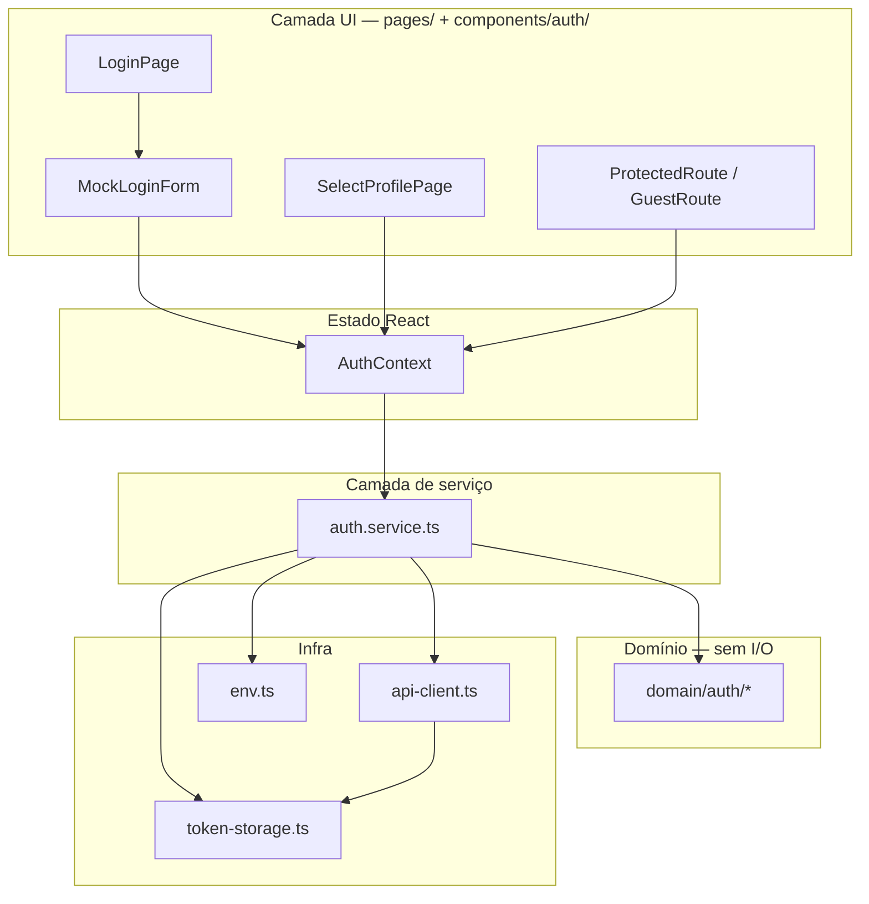

# Auth Login & Persistência — Specification

**Feature slug:** `auth-login-persistence`  
**Status:** Draft — contrato de login confirmado no backend; `GET /users/me` ainda inexistente  
**Prioridade demo:** P0 (ROADMAP P0.1 + P0.2)  
**Depende de:** infra HTTP em `.specs/features/api-integration/` (`api-client`, `env`, `token-storage`)

---

## Problem Statement

O frontend possui fluxo visual de login e guards de rota, mas a sessão vive apenas em `useState` — **F5 apaga autenticação**. As chamadas HTTP de auth ainda não estão conectadas ao backend real (`POST /v1/auth/login` já existe). Guards e redirects usam strings literais fora de `ROUTES`, e há três fontes de verdade conflitantes (`user`, `isAuthenticated`, `selectedProfile`).

Precisamos de login REST (ou mock) com **persistência de sessão**, rotas guest/protected consistentes e **separação correta de camadas** — sem `fetch` em páginas ou contexto.

---

## Goals

- [x] Login funcional via `auth.service.ts` (mock ou HTTP conforme `resolveApiMode()`)
- [x] Sessão persistente entre reloads (token + snapshot mínimo de usuário/perfil)
- [x] Rotas de login, seleção de perfil e guards alinhadas a `ROUTES` e padrão `ProtectedRoute`
- [x] Camadas respeitadas: UI → Context (estado) → Service (I/O) → Domain (regras/tipos) → Lib (transporte/storage)
- [x] Modo mock preservado como default (`VITE_USE_MOCKS=true`) sem regressão da demo

---

## Out of Scope

| Item | Motivo |
|------|--------|
| Refresh token / silent renew | Backend não expõe refresh; fora do P0 |
| OAuth / SSO / magic link | Escopo futuro |
| Wallet / passkey | Feature `wallet-passkey` |
| Integração HTTP de duplicatas, cadastro, revisão | Features/services separados |
| Implementação de `GET /users/me` no backend | Dependência externa (B1); spec define fallback |
| `POST /auth/logout` server-side | Token stateless; logout é client-side |
| Testes automatizados (Vitest/E2E) | Pós-demo; gate manual + typecheck |
| Remover credenciais demo do formulário | Pós-demo / flag DEV |

---

## Contrato REST confirmado (backend)

| Aspecto | Valor |
|---------|-------|
| Endpoint login | `POST /v1/auth/login` |
| Request body | `{ email: string, password: string }` |
| Sucesso `200` | `{ accessToken: string, tokenType: "Bearer", expiresInSeconds: number }` |
| Erros | `400 validation_error`, `401 invalid_credentials`, `403 account_inactive`, `503 JWT_SECRET not configured` |
| Auth subsequente | Header `Authorization: Bearer <accessToken>` |
| Claims JWT (payload) | `sub` (user id), `role`, `principalKind` |
| Endpoint perfil | **Não existe** — `PATCH /users/me/profile` permanece TBD (ROADMAP P0.2) |

**Mapeamento de roles (backend → frontend):**

| Backend (`role`) | `UserProfile` frontend | Observação |
|------------------|------------------------|------------|
| `seller` | `seller` | Cedente |
| `admin` | `admin` | Admin |
| `risk_analyst`, `risk_analyst_agent` | `riskAnalyst` | Analista de risco |
| `payer` | — | Persona inativa no front; login SHALL exibir erro amigável em PT |

---

## Arquitetura de camadas (obrigatório)

Separação alinhada ao mercado (Container/Presentational + Service Layer) e ao projeto Dupply:



### Regras de fronteira

| Camada | Pode fazer | **Não** pode fazer |
|--------|------------|---------------------|
| **Pages / components** | Renderizar UI; chamar métodos do `AuthContext`; navegar com `ROUTES` | `fetch`, `apiRequest`, ler/escrever `sessionStorage` diretamente |
| **AuthContext** | Manter `AuthState`; delegar login/logout/restore ao service; expor `useAuth()` | HTTP, parsing de JWT, regras de mapeamento de role |
| **auth.service.ts** | Orquestrar mock vs HTTP; persistir token/snapshot; chamar `apiRequest` | JSX, hooks React, navegação |
| **domain/auth/** | Tipos, schemas Zod de login, mappers role↔profile, helpers de redirect | Importar React, `api-client`, `token-storage` |
| **lib/api-client.ts** | Transporte HTTP genérico + header Bearer + tratamento 401 no token | Lógica de negócio de auth, popular `AuthContext` |
| **lib/token-storage.ts** | Get/set/clear de chaves no `sessionStorage` | Validar token, decidir perfil |

**Anti-patterns proibidos nesta feature:**

- `MockLoginForm` importando `apiRequest` ou `setAccessToken`
- `AuthContext` chamando `fetch` ou `apiRequest`
- Página decidindo mapeamento `risk_analyst` → `riskAnalyst` (vai para `domain/auth`)
- Componente lendo token do storage para montar header HTTP

---

## User Stories

### P1: Login REST/mock via service ⭐ MVP

**User Story**: Como usuário, quero entrar com e-mail e senha para acessar a plataforma com sessão válida.

**Why P1**: P0.1 da demo; desbloqueia todo fluxo autenticado.

**Acceptance Criteria**:

1. WHEN usuário submete login válido em modo mock THEN `auth.service.login()` SHALL validar via mock atual e retornar sucesso sem HTTP
2. WHEN usuário submete login válido em modo HTTP THEN `auth.service.login()` SHALL chamar `POST /v1/auth/login` via `apiRequest` com `{ auth: false }`
3. WHEN login HTTP retorna `accessToken` THEN service SHALL persistir token via `token-storage` e retornar DTO de sessão normalizado para o domínio
4. WHEN login falha (`401`, `403`, rede, timeout) THEN UI SHALL exibir toast em português e **não** alterar `AuthContext`
5. WHEN login sucesso THEN `AuthContext` SHALL receber estado autenticado via método exposto pelo provider (ex.: `loginWithSession(session)`), **não** montando user manualmente na UI
6. WHEN credenciais inválidas THEN system SHALL exibir mensagem genérica em PT (ex.: "E-mail ou senha incorretos") sem vazar se o e-mail existe

**Independent Test**: Login com seed `seller@dupply.dev.local` + senha dev → redirect para seleção de perfil ou dashboard conforme regra de perfil.

**Req IDs:** `ALP-01`, `ALP-02`, `ALP-03`, `ALP-04`

---

### P1: Persistência de sessão ⭐ MVP

**User Story**: Como usuário, quero permanecer logado após recarregar a página.

**Why P1**: Resolve dívida documentada em CONCERNS.md; crítico para demo.

**Acceptance Criteria**:

1. WHEN login sucesso THEN system SHALL persistir em `sessionStorage`: `accessToken` + snapshot `{ userId, email, platformRole, selectedProfile? }`
2. WHEN app inicia (`AuthProvider` mount) THEN `auth.service.restoreSession()` SHALL reidratar `AuthContext` se token presente e não expirado
3. WHEN token expirado (claim `exp` no passado) THEN system SHALL limpar storage e manter usuário deslogado
4. WHEN restore falha (token ausente/corrompido) THEN system SHALL iniciar em estado guest sem erro visível
5. WHEN logout THEN system SHALL limpar token **e** snapshot de sessão

**Independent Test**: Login → F5 → ainda autenticado; logout → F5 → guest.

**Req IDs:** `ALP-05`, `ALP-06`, `ALP-07`, `ALP-08`

---

### P1: Rotas de login e guards ⭐ MVP

**User Story**: Como usuário, quero ser redirecionado corretamente entre rotas públicas e protegidas conforme meu estado de sessão.

**Why P1**: Completar P0.1/P0.2 de routing; eliminar drift `ROUTES` vs `App.tsx`.

**Acceptance Criteria**:

1. WHEN usuário não autenticado acessa rota protegida THEN `ProtectedRoute` SHALL redirecionar para `ROUTES.login` preservando `location` em state (para retorno pós-login)
2. WHEN usuário autenticado acessa `ROUTES.login` THEN página SHALL redirecionar para `ROUTES.selectProfile` ou dashboard do perfil ativo
3. WHEN usuário autenticado sem `selectedProfile` acessa rota com guard de perfil THEN system SHALL redirecionar para `ROUTES.selectProfile`
4. WHEN usuário autenticado com perfil incompatível THEN system SHALL redirecionar para `ROUTES.selectProfile`
5. WHEN definir paths no router THEN `App.tsx` SHALL consumir constantes de `ROUTES` (sem strings literais duplicadas)
6. WHEN deep link protegido após login THEN system SHALL navegar para URL original se guardada em state

**Rotas envolvidas (já existentes — comportamento a corrigir/alinhar):**

| Rota | Tipo | Guard |
|------|------|-------|
| `ROUTES.login` | Guest | Redireciona se já autenticado |
| `ROUTES.selectProfile` | Semi-protegida | Requer sessão; guest → login |
| `ROUTES.seller.*`, `ROUTES.analyst.*`, `ROUTES.admin.*` | Protegida | `ProtectedRoute` + perfil |

**Independent Test**: Acessar `/seller/duplicatas` deslogado → login → retorno à rota original (se implementado state).

**Req IDs:** `ALP-09`, `ALP-10`, `ALP-11`, `ALP-12`

---

### P2: Seleção de perfil alinhada ao backend

**User Story**: Como usuário com role definida no backend, quero ver apenas perfis compatíveis e ir ao dashboard correto.

**Why P2**: P0.2 ROADMAP; hoje o card permite qualquer perfil (hackathon).

**Acceptance Criteria**:

1. WHEN sessão HTTP e `platformRole` mapeável THEN `SelectProfilePage` SHALL exibir somente perfis autorizados derivados do domínio (`getAvailableProfiles(platformRole)`)
2. WHEN usuário possui exatamente um perfil permitido THEN system SHALL auto-selecionar perfil e pular `SelectProfilePage` indo a `getProfileRedirect(profile)`
3. WHEN usuário seleciona perfil THEN `AuthContext.setProfile()` SHALL persistir `selectedProfile` no snapshot de sessão
4. WHEN modo mock THEN system SHALL manter comportamento atual (três cards) para demo local
5. WHEN `PATCH /users/me/profile` existir no backend THEN service SHALL sincronizar perfil via HTTP **sem** mudar assinatura pública do contexto (adapter interno)

**Independent Test**: Login como `risk@dupply.dev.local` → só card analista; login mock → três cards.

**Req IDs:** `ALP-13`, `ALP-14`, `ALP-15`

---

### P2: Logout e sessão invalidada (401)

**User Story**: Como usuário, quero ser deslogado automaticamente quando minha sessão expira no servidor.

**Why P2**: Comportamento padrão Bearer SPA; já parcialmente em `api-client`.

**Acceptance Criteria**:

1. WHEN usuário aciona logout THEN `auth.service.logout()` SHALL limpar storage e `AuthContext` SHALL resetar estado guest
2. WHEN qualquer request autenticada retorna `401` THEN `api-client` SHALL limpar token e notificar `AuthContext` para logout + redirect `ROUTES.login`
3. WHEN logout ou 401 THEN UI autenticada SHALL exibir toast opcional em PT ("Sessão expirada")
4. WHEN logout THEN system SHALL **não** chamar endpoint inexistente no backend

**Independent Test**: Token inválido manual no storage → próxima ação HTTP → redirect login.

**Req IDs:** `ALP-16`, `ALP-17`, `ALP-18`

---

### P3: Hidratação de usuário sem `GET /users/me`

**User Story**: Como dev, quero exibir nome/e-mail do usuário logado mesmo sem endpoint de perfil.

**Why P3**: Backend ainda não expõe `/users/me`; necessário para UX mínima.

**Acceptance Criteria**:

1. WHEN login HTTP sucesso THEN snapshot SHALL incluir `email` informado no formulário e `userId` de `sub` do JWT (decode payload **sem** verificar assinatura — apenas leitura de claims para UI)
2. WHEN restore de sessão THEN UI SHALL usar snapshot persistido para `user.email` / `user.name` (fallback: parte local do e-mail)
3. WHEN `GET /users/me` estiver disponível THEN service SHALL preferir endpoint e depreciar decode client-side (sem mudar `AuthContext`)

**Independent Test**: Após login HTTP, header/sidebar mostra e-mail correto após F5.

**Req IDs:** `ALP-19`, `ALP-20`

---

## Edge Cases

- WHEN `VITE_USE_MOCKS=false` sem `VITE_API_BASE_URL` THEN `resolveApiMode()` SHALL fallback mock com warning (comportamento existente em `env.ts`)
- WHEN login com role `payer` THEN system SHALL bloquear com mensagem PT explicando persona indisponível
- WHEN conta `403 account_inactive` THEN toast SHALL informar conta inativa; não persistir token
- WHEN `AuthProvider` ainda reidratando THEN guards SHALL tratar estado `isLoading` e não flash redirect incorreto (spinner ou null breve)
- WHEN StrictMode double-mount em dev THEN restore SHALL ser idempotente (sem duplicar side effects)
- WHEN usuário autenticado acessa `ROUTES.sellerRegistration` THEN comportamento atual de cadastro público SHALL ser preservado
- WHEN JWT malformado no storage THEN restore SHALL falhar silenciosamente para guest

---

## DTOs e tipos (domínio)

Contratos normalizados em `domain/auth/` (não vazar shape REST na UI):

```ts
/** Resposta normalizada pós-login — independente de mock ou HTTP */
type AuthSession = {
  user: {
    id: string;
    email: string;
    name: string;
    platformRole: string;
  };
  accessToken?: string; // ausente em mock puro
  expiresAtMs?: number;
};

/** Snapshot persistido além do token */
type PersistedAuthSnapshot = {
  userId: string;
  email: string;
  platformRole: string;
  selectedProfile: UserProfile | null;
};
```

Schema Zod de login (`domain/auth/auth-login.schema.ts` — a criar): e-mail + senha obrigatórios, mensagens PT.

---

## Endpoints e responsabilidades

| Operação | Camada responsável | Transporte |
|----------|-------------------|------------|
| Login | `auth.service.ts` | `POST /v1/auth/login` ou mock |
| Persistir token | `auth.service.ts` → `token-storage.ts` | sessionStorage |
| Restore sessão | `auth.service.ts` | read storage + decode exp |
| Logout | `auth.service.ts` | clear storage |
| Requests autenticadas | outros services via `api-client` | Bearer automático |
| Redirect por perfil | `domain/auth/auth.helpers.ts` | — |
| Guards de rota | `App.tsx` (ou `routes/guards.tsx`) | consome `useAuth()` |

---

## Success Criteria

- [x] Login mock idêntico ao comportamento atual com `VITE_USE_MOCKS=true` (default)
- [ ] Login HTTP contra backend local com usuários seed funciona end-to-end *(requer teste manual com backend up)*
- [x] F5 mantém sessão autenticada com perfil selecionado
- [x] Nenhum `fetch`/`apiRequest`/`sessionStorage` direto em pages ou components de auth
- [x] `npm run typecheck` passa
- [x] Guards usam `ROUTES.*` consistentemente

---

## Requirement Traceability

| Req ID | Story | Fase | Status |
|--------|-------|------|--------|
| ALP-01 | P1: Login service mock | Design | Done |
| ALP-02 | P1: Login service HTTP | Design | Done |
| ALP-03 | P1: Persist token pós-login | Design | Done |
| ALP-04 | P1: Erros login UI | Design | Done |
| ALP-05 | P1: Snapshot sessão | Design | Done |
| ALP-06 | P1: Restore no boot | Design | Done |
| ALP-07 | P1: Token expirado | Design | Done |
| ALP-08 | P1: Logout limpa storage | Design | Done |
| ALP-09 | P1: Protected redirect login | Design | Done |
| ALP-10 | P1: Guest redirect autenticado | Design | Done |
| ALP-11 | P1: Guard perfil | Design | Done |
| ALP-12 | P1: ROUTES no router | Design | Done |
| ALP-13 | P2: Perfis filtrados por role | Design | Done |
| ALP-14 | P2: Auto-skip select profile | Design | Done |
| ALP-15 | P2: Persist selectedProfile | Design | Done |
| ALP-16 | P2: Logout manual | Design | Done |
| ALP-17 | P2: 401 global | Design | Done |
| ALP-18 | P2: Toast sessão expirada | Design | Done |
| ALP-19 | P3: Snapshot email/userId | Design | Done |
| ALP-20 | P3: Fallback GET /users/me | Design | Blocked (B1) |

**Coverage:** 20 requisitos → 10 tasks em [tasks.md](./tasks.md) (T9 bloqueada por B1)

---

## Related

- [api-integration/spec.md](../api-integration/spec.md) — infra HTTP compartilhada (API-03, API-04, AUTH-*)
- [ROADMAP.md](../../project/ROADMAP.md) — P0.1, P0.2
- [STATE.md](../../project/STATE.md) — blocker B1
- [CONCERNS.md](../../codebase/CONCERNS.md) — auth sem persistência, guards frágeis
- [ARCHITECTURE.md](../../codebase/ARCHITECTURE.md) — fluxo auth atual
- Backend: `dupply-backend/src/routes/v1/auth.ts`

---

## Próximo passo

Implementar conforme [tasks.md](./tasks.md) — ordem: T1 → T2 → T3 → T4 → T5/T6 → T7 → T8 → T10.
