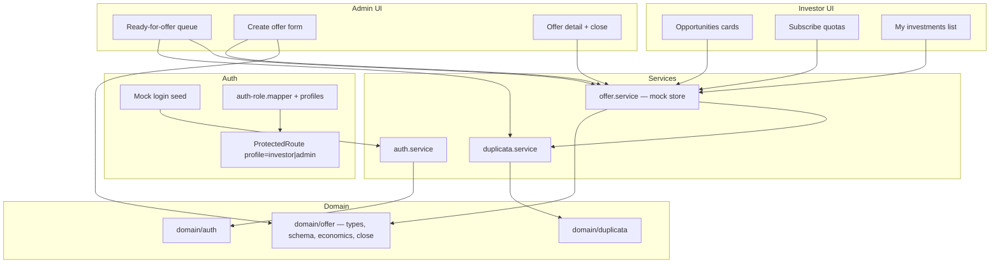
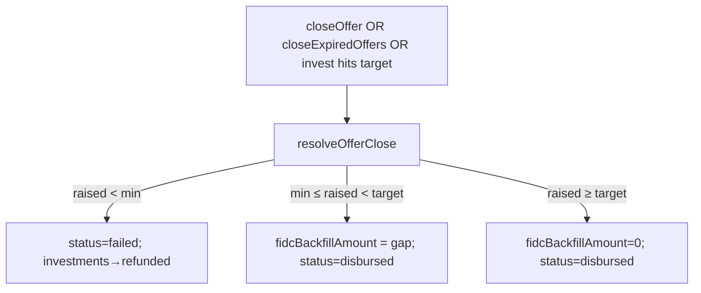

# Investor Marketplace — Design (Tech Spec)

**Spec:** [spec.md](./spec.md)  
**Context:** [context.md](./context.md)  
**Meeting Qs:** [meeting-questions.md](./meeting-questions.md)  
**Status:** Approved — 2026-07-26  
**Scope:** Frontend mock-only (`VITE_USE_MOCKS` path); no REST contract in this feature

---

## Architecture Overview

Extend the existing layered SPA: UI → (optional Context) → Service (mock store) → Domain (types, Zod, pure helpers). New **Offer** aggregate lives beside duplicatas; investor is a new `UserProfile` wired like seller/admin/analyst.



**Eligibility (no new duplicata status enum required):**

```
ready_for_offer ⇔ duplicata.analiseAnalista === "aprovado"
                 ∧ no Offer exists for duplicataId
```

Seller accept still sets `aprovado`; toast/copy changes only. Listing for investors = offers with `status === "fundraising"`.

---

## Code Reuse Analysis

### Existing to leverage

| Piece | Location | How |
|-------|----------|-----|
| `UserProfile` + guards | `domain/auth/*`, `routes/guards.tsx` | Add `"investor"`; map role `investor` |
| Profile labels/redirects | `auth.helpers.ts`, `auth-profiles.ts` | Investor home → opportunities |
| `ROUTES` + `App.tsx` | `lib/routes.ts`, `App.tsx` | Add `ROUTES.investor.*` + `ROUTES.admin.offers.*` |
| Sidebar | `components/layout/Sidebar.tsx` | `investorNav` + admin offer links |
| Profile switcher | `ProfileSwitcher.tsx` | Include investor in mock list |
| Mock login | `auth.service.ts`, `MockLoginForm.tsx` | Investor seed user |
| Duplicata store | `duplicata.service.ts` | Read face, discount, scores; accept toast tweak |
| `calcValorLiquidoCedente` | `duplicata-antecipacao.helpers.ts` | Default `targetAmount` |
| Scores | `DuplicataTitulo.scoreDuplicata` | Map → risk level for cards (no names) |
| `Progress` | `components/ui/progress.tsx` | Funding progress bar |
| List → detail | Analyst duplicatas / admin sellers | Same navigation pattern |
| Zod + RHF safeParse | `seller-registration.schema.ts` pattern | Offer create + invest schemas |
| Empty folders | `domain/investor/`, `pages/investor/`, `components/investor/` | Populate (investor UI); offer domain is separate |

### Fragile areas (CONCERNS)

| Concern | Mitigation in this design |
|---------|---------------------------|
| Module-level mutable mock stores | Same pattern as `duplicata.service` for speed; keep mutations in one `offer.service.ts`; return clones on read |
| Dual receivables vs duplicatas | **Do not** extend receivables; offers attach to `DuplicataTitulo` only |
| Wizard without Zod on duplicata flows | New offer/invest forms **use Zod in domain** |
| Investor scaffold empty | Fill intentionally; remove “investor out of scope” from PROJECT later |

### Integration points

| System | Method |
|--------|--------|
| Duplicata lifecycle | Soft dependency: accept → eligible; offer create reads duplicata snapshot fields |
| Auth | New platform role + profile; mock-only seed |
| HTTP | Out of scope — always mock path for offer APIs in this feature |

---

## Components

### Domain — `src/domain/offer/`

#### Types (`offer.types.ts`)

- **Purpose:** English domain model for Offer + Investment + statuses
- **Exports:** `Offer`, `Investment`, `OfferStatus`, `InvestmentStatus`, `RiskLevel`, create/invest input types

#### Economics (`offer-economics.helpers.ts`)

- **Purpose:** Pure calculations — target default, quota count, estimated investor return, progress percents, FIDC gap
- **Interfaces:**
  - `calcDefaultTargetAmount(faceValue, analystDiscountPercent): number`
  - `calcQuotaCount(targetAmount, quotaPrice): number`
  - `calcEstimatedInvestorReturnPercent(analystDiscountPercent, platformSpreadPercent): number`
  - `calcRaisedAmount(quotaPrice, quotasSold): number`
  - `calcFundingProgress(raisedAmount, targetAmount): number` — 0–100
  - `calcMinProgress(minAmount, targetAmount): number` — marker on bar
  - `calcFidcGap(targetAmount, raisedAmount): number`
- **Reuses:** `calcValorLiquidoCedente` for default target

#### Close rules (`offer-close.helpers.ts`)

- **Purpose:** Deterministic close outcome (pure)
- **Interfaces:**
  - `resolveOfferClose(input: { raisedAmount, minAmount, targetAmount }): { outcome: "failed" \| "full" \| "partial_with_fidc"; fidcAmount: number }`

#### Risk (`offer-risk.helpers.ts`)

- **Purpose:** Map `scoreDuplicata` → `RiskLevel` for investor UI (no counterparty names)
- **Interfaces:**
  - `mapScoreToRiskLevel(score: number): RiskLevel` — e.g. `<50 low` / `<75 medium` / else `high` (tune in impl; document constants)

#### Labels (`offer.constants.ts`)

- **Purpose:** PT labels for statuses / risk (UI copy only)

#### Schemas (`offer.schema.ts`, `invest.schema.ts`)

- **Purpose:** Zod validation for admin create + investor subscribe
- **Reuses:** Seller registration style (`safeParse` on submit)

---

### Service — `src/services/offer.service.ts`

- **Purpose:** In-memory offer + investment store; all marketplace mutations
- **Interfaces (async, mirror duplicata.service):**
  - `listOffers(filters?: { status?: OfferStatus \| OfferStatus[] }): Promise<Offer[]>`
  - `listFundraisingOffers(): Promise<Offer[]>`
  - `getOfferById(id: string): Promise<Offer \| null>`
  - `getOfferByDuplicataId(duplicataId: string): Promise<Offer \| null>`
  - `listDuplicatasReadyForOffer(): Promise<DuplicataTitulo[]>` — `aprovado` ∧ no offer
  - `createOffer(input: CreateOfferInput): Promise<Offer>`
  - `investInOffer(input: { offerId, investorUserId, quotaCount }): Promise<Investment>`
  - `listInvestmentsByInvestor(investorUserId: string): Promise<Investment[]>`
  - `closeOffer(offerId: string): Promise<Offer>` — admin manual close
  - `closeExpiredOffers(now?: Date): Promise<Offer[]>` — deadline auto-close; call from list/detail loaders
- **Dependencies:** `domain/offer/*`, `duplicata.service` (read), optional seed in `data/offers.mock.ts`
- **Invariants:**
  - One offer per `duplicataId` (enforce on create)
  - Invest only if `status === "fundraising"` and `quotaCount ≤ remaining`
  - Close applies `resolveOfferClose`; on `failed` mark investments `refunded`; on partial set `fidcBackfillAmount` and status `disbursed`; on full `disbursed` with `fidcBackfillAmount = 0`
  - If invest reaches target → auto-close as `full` (same helper)

---

### Auth extensions

| File | Change |
|------|--------|
| `auth.types.ts` | `UserProfile` += `"investor"` |
| `auth-role.mapper.ts` | `investor: ["investor"]` |
| `auth-profiles.ts` | Include in `MOCK_DEMO_PROFILES` |
| `auth.helpers.ts` | Label/description/redirect → `ROUTES.investor.opportunities` |
| `auth.service.ts` | Mock seed: e.g. `investor@dupply.com.br` / shared demo password pattern; `platformRole: "investor"` |
| `ProfileSwitcher.tsx` | Add investor card |
| `MockLoginForm.tsx` | Optional quick-fill for investor seed |

---

### Routes & shell

**`lib/routes.ts`:**

```ts
investor: {
  opportunities: "/investor/opportunities",
  offerDetail: (id: string) => `/investor/offers/${id}`,
  investments: "/investor/investments",
},
admin: {
  // existing...
  offers: {
    ready: "/admin/offers/ready",
    list: "/admin/offers",
    detail: (id: string) => `/admin/offers/${id}`,
    create: (duplicataId: string) => `/admin/offers/new/${duplicataId}`,
  },
}
```

**`App.tsx`:** `ProtectedRoute` + `AppShell` for each; paths from `ROUTES`.

**`Sidebar.tsx`:**

- Investor: Oportunidades, Meus investimentos  
- Admin: + “Ofertas” / “Prontas para oferta” (PT labels)

---

### UI — Investor (`src/pages/investor/`, `src/components/investor/`)

| Component | Purpose |
|-----------|---------|
| `InvestorOpportunitiesPage` | Grid of fundraising offer cards; calls `closeExpiredOffers` then `listFundraisingOffers` |
| `OpportunityOfferCard` | Card: risk level, target, estimated return, quota price, time left, `Progress` + min marker, CTA |
| `InvestorOfferDetailPage` | Detail (still **no** sacado/cedente names); invest form |
| `InvestQuotaForm` | Quota count input; Zod; submit → `investInOffer` |
| `InvestorInvestmentsPage` | Minimal P1 list of positions + status |

---

### UI — Admin

| Component | Purpose |
|-----------|---------|
| `AdminOffersReadyPage` | Table of duplicatas ready for offer → create |
| `AdminCreateOfferPage` | Prefill face, analyst discount, default target; fields: quota price, min, deadline, platform spread %; live **estimated investor return** |
| `AdminOffersPage` | List all offers + status |
| `AdminOfferDetailPage` | Progress, investments, FIDC share; **Close offer** button |

---

### Duplicata touchpoints (minimal)

| File | Change |
|------|--------|
| `SellerDuplicataOperacaoWizardDialog` / seller toast | Copy: funding via investors / listing — not “crédito em até 2h” as platform payout |
| `setDuplicataDecisaoCedente` | No structural change required if eligibility is derived |

P3 seller registration copy: out of first implementation cut unless trivial.

---

## Data Models

### `OfferStatus`

```ts
type OfferStatus =
  | "fundraising" // em_captacao
  | "failed"      // below min
  | "disbursed";  // full or partial+FIDC completed
```

(Partial is not a durable status — close helper jumps to `disbursed` with `fidcBackfillAmount > 0`.)

### `InvestmentStatus`

```ts
type InvestmentStatus = "active" | "refunded" | "settled";
```

### `RiskLevel`

```ts
type RiskLevel = "low" | "medium" | "high";
```

### `Offer`

```ts
interface Offer {
  id: string;
  duplicataId: string;
  /** Snapshot fields for investor UI — no counterparty names */
  faceValue: number;
  analystDiscountPercent: number;
  platformSpreadPercent: number;
  estimatedInvestorReturnPercent: number;
  riskLevel: RiskLevel;
  scoreDuplicataSnapshot: number;
  targetAmount: number;
  minAmount: number;
  quotaPrice: number;
  quotaCount: number;
  quotasSold: number;
  raisedAmount: number;
  deadline: string; // ISO
  status: OfferStatus;
  backfillSource: "fidc";
  fidcBackfillAmount: number; // 0 until/unless partial close
  createdAt: string;
  closedAt?: string;
}
```

### `Investment`

```ts
interface Investment {
  id: string;
  offerId: string;
  investorUserId: string;
  quotaCount: number;
  amount: number; // quotaCount * quotaPrice
  status: InvestmentStatus;
  createdAt: string;
}
```

### `CreateOfferInput`

```ts
interface CreateOfferInput {
  duplicataId: string;
  quotaPrice: number;
  minAmount: number;
  deadline: string; // ISO
  platformSpreadPercent: number;
  /** Optional override; default = calcDefaultTargetAmount */
  targetAmount?: number;
}
```

**Relationships:** `Offer.duplicataId` → `DuplicataTitulo.id` (1:1). `Investment.offerId` → `Offer.id` (N:1).

---

## Economics rules (implementation)

| Rule | Formula / behavior |
|------|-------------------|
| Default target | `calcValorLiquidoCedente(face, analystDiscount)` |
| Quota count | `Math.ceil(targetAmount / quotaPrice)`; optionally snap `targetAmount = quotaCount * quotaPrice` on create (prefer snap for clean bars) |
| Platform spread | `% of face`, `0 ≤ spread ≤ analystDiscountPercent` |
| Estimated investor return % | `analystDiscountPercent - platformSpreadPercent` (shown on create + cards) |
| Raised | `quotasSold * quotaPrice` |
| Min validation | `0 < minAmount ≤ targetAmount` |
| Oversubscribe | Reject; UI caps input to `quotaCount - quotasSold` |
| Spread = discount | Allow with warning in form (return 0%) — or block if UX prefers; **default: warn + allow** |

---

## Close + deadline behavior



- **Admin:** button on detail calls `closeOffer`
- **Auto:** `closeExpiredOffers(now)` on investor opportunities load + admin offers load (and detail). Optional tiny “Simular deadline” control on admin detail for demo (sets deadline to past then closes) — agent discretion, keep small
- **Transparency:** detail UI shows `raisedAmount` vs `fidcBackfillAmount` after close

---

## Error Handling Strategy

| Scenario | Handling | User impact |
|----------|----------|-------------|
| Duplicate offer for same duplicata | Throw domain/service error | PT toast/form error |
| Validation fail (Zod) | Field errors | Inline PT messages |
| Invest > remaining quotas | Reject | Toast / form error |
| Invest on non-fundraising | Reject | Toast |
| Offer not found | null / navigate away | Empty / 404-style message |
| Close already closed | No-op or error | Toast “Oferta já encerrada” |
| Spread > analyst discount | Zod reject | Field error |

---

## Tech Decisions

| Decision | Choice | Rationale |
|----------|--------|-----------|
| Offer domain module name | `domain/offer` (not nested only under investor) | Offer is shared admin+investor aggregate |
| Durable statuses | `fundraising \| failed \| disbursed` | Partial is an event outcome, not a lingering state |
| Eligibility | Derived from `aprovado` + no offer | Avoid duplicata enum churn |
| Investor card PII | Risk level only | Locked in context |
| Estimated return | Derived = discount − platform spread | Matches “spread inside analyst bag” |
| Mock store | Module `let` like duplicata | Consistent with demo codebase; HTTP later |
| Code language | English identifiers | Project + context |
| Auto-close | On read paths + admin button | Satisfies “both” without real cron |
| P2 rich portfolio | Defer | P1 = `InvestorInvestmentsPage` minimal list |
| Receivables legacy | Untouched | Prevent dual-model growth |

---

## Requirement mapping (Design)

| ID | Design coverage |
|----|-----------------|
| INV-01 | Auth profile + routes + sidebar + seed |
| INV-02 | `listDuplicatasReadyForOffer` + toast copy |
| INV-03 | `createOffer` + AdminCreateOfferPage + Zod |
| INV-04 | OpportunityOfferCard + Progress |
| INV-05 | investInOffer + detail form + investments list |
| INV-06 | offer-close.helpers + closeOffer + closeExpiredOffers + FIDC fields |
| INV-07 | Deferred (richer page) — minimal list under INV-05 |
| INV-08 | AdminOfferDetailPage + close button |
| INV-09 | P3 — optional / deferred |

---

## Out of design scope

- REST endpoints / adapters  
- Real FIDC / custody / payments  
- Investor KYC registration  
- `ops` role  
- Showing sacado/cedente names  

---

## Open implementation notes (non-blocking)

- Exact score→risk thresholds: pick constants in `offer-risk.helpers.ts` and adjust after UI review  
- Demo seed offers (optional): 3 fixtures for failed / partial / full close demos  
- Whether admin “Simular deadline” button ships in P1: yes if &lt;30 lines; else document manual `deadline` edit in mock seed only  
