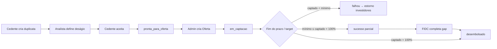

# Marketplace de Investimento em Duplicatas — Specification

**Feature slug:** `investor-marketplace`  
**Status:** Implemented (mock frontend) — 2026-07-26  
**Prioridade:** Nova fatia de produto (mock-first no frontend)  
**Depende de:** fluxo atual de duplicata até aceite do cedente (`aprovado`); auth/perfis existentes

---

## Problem Statement

Hoje, após o cedente aceitar a oferta de antecipação, a narrativa da plataforma é de liquidação quase imediata — como se a Dupply (ou um FIDC interno) fornecesse o capital. Isso não escala e não abre a segunda ponta do marketplace: **investidores** que financiam títulos aprovados.

Precisamos de um fluxo mockado no frontend em que duplicatas aceitas viram **ofertas de investimento** (cotas), investidores captam via cards com progresso, e um **FIDC complementar** cobre o gap quando a oferta atinge o mínimo mas não 100%.

---

## Goals

- [ ] Persona **investidor** utilizável em mock (login → perfil → oportunidades → investir)
- [ ] Entidade **Oferta** separada da duplicata, criada pelo **admin** após aceite do cedente
- [ ] Captação por título (1 duplicata = 1 oferta) com **mínimo**, **target**, cotas e progress bar
- [ ] Fechamento híbrido: &lt; mínimo falha e devolve; ≥ mínimo e &lt; 100% desembolsa + **FIDC completa o gap**
- [ ] Spread da plataforma definido no **cadastro da oferta**, dentro do deságio já definido pelo analista
- [ ] 100% mock/local no frontend nesta feature (sem contrato REST obrigatório)

---

## Out of Scope

| Item | Motivo |
|------|--------|
| Integração HTTP / backend real de ofertas e investimentos | Mock-first; API em feature futura |
| Cadastro público completo de investidor (KYC real, suitability CVM) | MVP mock; login seed + dados mínimos se necessário |
| Role `ops` / estruturador dedicada | Admin cobre no MVP; role extra é follow-up |
| Wallet / passkey do investidor | Feature `wallet-passkey` separada |
| Pool de várias duplicatas numa oferta | Escopo = 1:1 |
| Mercado secundário de cotas | Fora do MVP |
| Parecer jurídico / registro CVM / estruturação real de FIDC | Produto mock; jurídico em paralelo fora do código |
| Alterar precificação do analista (faixa 2–3,5%) | Mantém; oferta só **reparte** o deságio |
| Pagamentos on-chain / settlement real | Mock de estados e valores |

---

## Modelo de domínio (produto)

### Relação

| Entidade | Papel |
|----------|--------|
| **Duplicata** | Título já existente; após aceite fica elegível a oferta |
| **Oferta** | Nova entidade 1:1 com duplicata; parâmetros de captação e cotas |
| **Investimento** | Subscrição de N cotas por um investidor mock |
| **FIDC (ator mock)** | Completa o gap quando oferta fecha ≥ mínimo e &lt; target |

### Economia da oferta

- O **deságio total** vem da duplicata (`descontoAntecipacaoPercent` definido pelo analista).
- No cadastro da oferta, o admin informa o **spread da plataforma** (success fee / cut), **dentro** desse deságio — não empilha taxa a.m. extra.
- O restante do deságio remunera os **investidores** (e, no gap, o FIDC na mesma lógica de retorno da oferta, salvo regra explícita futura).
- Default sugerido de spread plataforma no mock: **1% do valor de face** (configurável; faixa razoável 0,8%–1,5%), desde que `spreadPlataforma ≤ deságioTotal`.

### Captação

| Campo (oferta) | Quem define | Notas |
|----------------|-------------|--------|
| Valor target | Sistema / admin | Tipicamente ≈ valor líquido da antecipação ao cedente |
| Mínimo captado (`minAmount` ou %) | Admin | Abaixo disso → falha + estorno |
| Preço da cota | Admin | Ex.: R$ 100 / R$ 1.000 |
| Nº de cotas | Sistema ou admin | Derivável: `ceil(target / preçoCota)` |
| Prazo / deadline | Admin | Fim da janela de captação |
| Spread plataforma % | Admin | Dentro do deságio do analista |
| `backfillSource` | Admin / default | MVP: `fidc` |

### Regras de fechamento

1. **Antes do deadline**, se captado atingir 100% do target → pode fechar antecipado (sucesso total).
2. **No deadline (ou fechamento):**
   - captado **&lt; mínimo** → status `falhou`; todos os investimentos mock são estornados; duplicata **não** é desembolsada.
   - captado **≥ mínimo e &lt; 100%** → status `sucesso_parcial`; desembolso do captado ao cedente (mock); **FIDC complementa o gap** até o target; status final `desembolsado`.
   - captado **= 100%** → `desembolsado` sem backfill.
3. Cedente só “recebe” (estado mock) após fechamento bem-sucedido (≥ mínimo), não no aceite da antecipação.

---

## User Stories

### P1: Perfil investidor mock ⭐ MVP

**User Story**: Como investidor, quero entrar na plataforma com um perfil próprio para ver oportunidades de investimento.

**Why P1**: Sem persona e rotas, o marketplace não é demonstrável.

**Acceptance Criteria**:

1. WHEN existe usuário mock com role/plataforma compatível com investidor THEN system SHALL permitir login e seleção do perfil `investor`
2. WHEN investidor autentica com perfil `investor` THEN system SHALL redirecionar para a home/oportunidades do investidor (não para rotas de cedente/analista)
3. WHEN usuário com role incompatível tenta acessar rota de investidor THEN system SHALL bloquear via `ProtectedRoute` e redirecionar conforme padrão atual de perfil
4. WHEN modo mock está ativo THEN system SHALL expor ao menos um seed de investidor na seleção/login demo

**Independent Test**: Login mock como investidor → landa em área de investidor sem erro de guard.

---

### P1: Duplicata aceita fica pronta para oferta ⭐ MVP

**User Story**: Como admin, quero que duplicatas aceitas pelo cedente fiquem elegíveis para eu estruturar uma oferta.

**Why P1**: Separar “aceite da antecipação” de “listado para investidores”.

**Acceptance Criteria**:

1. WHEN cedente aceita a operação (`analiseAnalista` → `aprovado`) THEN system SHALL marcar a duplicata como elegível a oferta (ex.: `pronta_para_oferta` / flag equivalente) em vez de implicar liquidação imediata
2. WHEN duplicata está elegível e ainda sem oferta THEN admin SHALL vê-la em lista/fila de “prontas para oferta”
3. WHEN toast/copy pós-aceite do cedente é exibido THEN system SHALL refletir captação/listagem (não “crédito em até 2h” como liquidação garantida da plataforma)

**Independent Test**: Aceitar duplicata no fluxo seller → ela aparece na fila admin de prontas para oferta; não aparece ainda nas oportunidades do investidor.

---

### P1: Admin cria Oferta ⭐ MVP

**User Story**: Como admin, quero cadastrar uma oferta a partir de uma duplicata elegível, definindo cotas, mínimo, prazo e spread da plataforma.

**Why P1**: Oferta é a entidade que o investidor consome.

**Acceptance Criteria**:

1. WHEN admin inicia criação de oferta a partir de duplicata elegível THEN system SHALL pré-preencher valor de face, deságio do analista, valor líquido sugerido e impedir criação se já existir oferta para aquela duplicata
2. WHEN admin informa preço da cota (e/ou nº de cotas), mínimo, deadline e spread da plataforma THEN system SHALL validar: spread ≥ 0, spread ≤ deságio do analista, mínimo &gt; 0, mínimo ≤ target, deadline no futuro
3. WHEN oferta é criada com sucesso THEN system SHALL persistir (mock) a Oferta com status `em_captacao` e vinculá-la 1:1 à duplicata
4. WHEN oferta entra em `em_captacao` THEN ela SHALL aparecer na listagem de oportunidades do investidor
5. WHEN admin omite campo obrigatório ou viola validação THEN system SHALL bloquear submit com mensagens claras em PT

**Independent Test**: Admin cria oferta válida → card aparece para o investidor com target/mínimo/cotas corretos.

---

### P1: Oportunidades em cards com progress bar ⭐ MVP

**User Story**: Como investidor, quero ver oportunidades em cards com o quanto já foi investido e o quanto falta.

**Why P1**: Superfície principal da persona; alinhada à visão de produto.

**Acceptance Criteria**:

1. WHEN investidor acessa oportunidades THEN system SHALL listar apenas ofertas `em_captacao` (e, se útil na mesma tela, estados finais com badge — detalhar em design/context)
2. WHEN um card é renderizado THEN system SHALL exibir ao menos: identificadores seguros da operação, valor target, retorno estimado ao investidor, preço/cota, prazo restante, progress bar captado/target e indicação em relação ao mínimo
3. WHEN captado muda (novo investimento mock) THEN a progress bar SHALL refletir o novo percentual sem reload manual completo da app (atualização via estado/serviço mock)
4. WHEN não há ofertas abertas THEN system SHALL exibir empty state claro

**Independent Test**: Com 1+ ofertas mock em captação, investidor vê cards com barra coerente com `captado/target`.

---

### P1: Investidor subscribe cotas ⭐ MVP

**User Story**: Como investidor, quero investir N cotas numa oferta aberta.

**Why P1**: Sem subscrição não há progresso nem demo de funding.

**Acceptance Criteria**:

1. WHEN investidor abre detalhe/ação de uma oferta `em_captacao` THEN system SHALL permitir informar quantidade de cotas (ou valor equivalente) respeitando cotas restantes
2. WHEN investimento é confirmado THEN system SHALL registrar Investimento mock, incrementar captado e reduzir cotas disponíveis
3. WHEN quantidade pedida &gt; cotas restantes THEN system SHALL rejeitar com erro amigável
4. WHEN oferta não está `em_captacao` THEN system SHALL impedir novos investimentos

**Independent Test**: Investir N cotas → barra sobe; carteira/histórico do investidor (mínimo: lista “meus investimentos”) mostra a posição.

---

### P1: Fechamento híbrido com FIDC no gap ⭐ MVP

**User Story**: Como plataforma, quero fechar ofertas com regra de mínimo e complementar gap via FIDC mock.

**Why P1**: Regra de negócio central do modelo híbrido.

**Acceptance Criteria**:

1. WHEN no fechamento captado &lt; mínimo THEN system SHALL marcar oferta `falhou`, estornar investimentos mock e **não** desembolsar ao cedente
2. WHEN no fechamento mínimo ≤ captado &lt; target THEN system SHALL marcar sucesso parcial, registrar backfill FIDC pelo valor do gap, atingir target e marcar `desembolsado`
3. WHEN captado atinge target antes ou no fechamento THEN system SHALL marcar `desembolsado` sem backfill FIDC
4. WHEN FIDC completa o gap THEN o card/detalhe SHALL evidenciar a parcela investidores vs parcela FIDC (transparência mock)
5. WHEN fechamento é disparado (ação admin e/ou simulação de deadline no mock) THEN as regras acima SHALL ser aplicadas de forma determinística

**Independent Test**: Três ofertas seed — uma abaixo do mínimo, uma parcial, uma 100% — fecham com estados e números corretos.

---

### P2: Carteira do investidor

**User Story**: Como investidor, quero ver meus investimentos e status (em captação / desembolsado / estornado).

**Why P2**: Melhora demo; P1 já exige lista mínima — P2 aprofunda.

**Acceptance Criteria**:

1. WHEN investidor acessa carteira THEN system SHALL listar investimentos com oferta, cotas, valor e status
2. WHEN investimento foi estornado por falha de mínimo THEN system SHALL exibir status estornado

**Independent Test**: Após investir e após falha de oferta, carteira reflete os dois casos.

---

### P2: Visão admin da oferta pós-criação

**User Story**: Como admin, quero acompanhar progresso da oferta e disparar fechamento/backfill.

**Why P2**: Operação da fila; P1 pode fechar via helper de mock se necessário.

**Acceptance Criteria**:

1. WHEN admin abre detalhe da oferta THEN system SHALL mostrar captado, mínimo, target, investidores mock e gap
2. WHEN admin dispara “fechar oferta” THEN system SHALL aplicar regras de fechamento híbrido

**Independent Test**: Admin fecha oferta parcial → gap FIDC + status desembolsado.

---

### P3: Ajustes de copy no cadastro do cedente

**User Story**: Como cedente, quero entender no cadastro/onboarding que o capital pode vir de investidores/FIDC, não “só do fundo Dupply”.

**Why P3**: Alinha expectativa; não bloqueia marketplace mock.

**Acceptance Criteria**:

1. WHEN textos de cadastro/validação mencionam origem do capital THEN copy SHALL refletir marketplace / investidores (sem prometer liquidação imediata da plataforma)

---

## Edge Cases

- WHEN duplicata elegível já possui oferta THEN system SHALL impedir segunda oferta
- WHEN último investimento ultrapassaria o target THEN system SHALL aceitar só até o restante de cotas (sem oversubscribe)
- WHEN spread plataforma = deságio total THEN retorno ao investidor SHALL ser 0% e UI SHALL avisar (ou validação impedir, conforme context)
- WHEN mínimo = 100% do target THEN parcial não existe; ou bate 100% ou falha (all-or-nothing)
- WHEN deadline passa sem ação manual THEN mock SHALL permitir simular passagem do tempo / job de fechamento (dev/demo control)
- WHEN investidor tenta investir 0 cotas THEN system SHALL rejeitar
- WHEN oferta falha THEN progress/histórico SHALL permanecer auditável (não apagar oferta; status `falhou`)

---

## Requirement Traceability

| Requirement ID | Story | Phase | Status |
| -------------- | ----- | ----- | ------ |
| INV-01 | P1: Perfil investidor mock | Design | In Design |
| INV-02 | P1: Duplicata pronta para oferta | Design | In Design |
| INV-03 | P1: Admin cria Oferta | Design | In Design |
| INV-04 | P1: Cards + progress bar | Design | In Design |
| INV-05 | P1: Subscribe cotas | Design | In Design |
| INV-06 | P1: Fechamento híbrido + FIDC | Design | In Design |
| INV-07 | P2: Carteira investidor | Design | Deferred (minimal list in INV-05) |
| INV-08 | P2: Admin acompanha/fecha oferta | Design | In Design |
| INV-09 | P3: Copy cadastro cedente | Design | Deferred |

**Coverage:** 9 total, 7 mapped in design.md, 2 deferred ⚠️

---

## Success Criteria

- [ ] Demo mock: admin cria oferta a partir de duplicata aceita → investidor vê card com barra → investe → barra sobe
- [ ] Demo mock: oferta parcial (≥ mín, &lt; 100%) fecha com FIDC no gap e status desembolsado
- [ ] Demo mock: oferta &lt; mínimo falha e estorna
- [ ] `npm run typecheck` passa
- [ ] Nenhuma dependência de API real para o happy path desta feature

---

## Decisões já fechadas (desta conversa)

| Tema | Decisão |
|------|---------|
| Híbrido | FIDC mock complementa o gap se ≥ mínimo e &lt; 100% |
| Granularidade | 1 duplicata = 1 oferta |
| Quem cria oferta | Admin no MVP (role ops depois) |
| Momento | Após aceite do cedente; entidade Oferta nova |
| Mínimo | Campo na oferta; abaixo = estorno total |
| Spread | % no cadastro da oferta, **dentro** do deságio do analista |
| UI oportunidades | Cards + progress bar captado vs falta |
| Escopo técnico imediato | Mock no frontend |

---

## Gray areas

Resolvidas em `context.md` (2026-07-26). Dúvidas de produção/jurídico: `meeting-questions.md`.

| # | Tema | Decisão |
|---|------|---------|
| 1 | Onboarding investidor | Só seed/login mock |
| 2 | Fechamento / FIDC | Ambos: botão admin + auto no deadline |
| 3 | Form da oferta | Spread plataforma + **retorno estimado** visível |
| 4 | Card | Só **nível de risco** — sem nome de sacado/cedente (MVP) |
| 5 | Carteira | P1 = lista mínima “meus investimentos”; P2 rica opcional depois |
| — | Código | Identifiers/domain em **inglês**; UI copy em PT |
